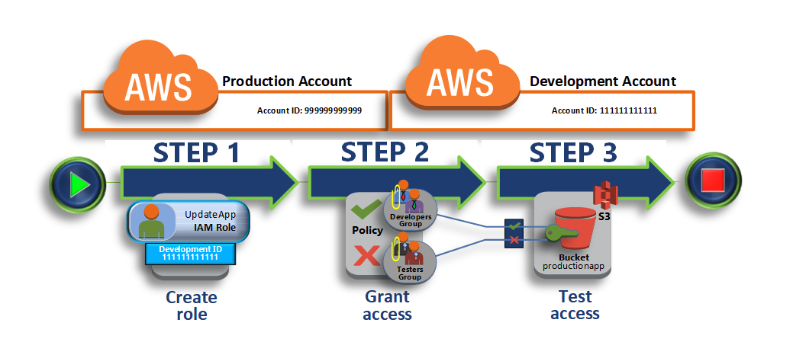

# Cross-Account Access
<https://docs.aws.amazon.com/IAM/latest/UserGuide/tutorial_cross-account-with-roles.html>

## Step 1: Create a role in the Production Account
First, you use the AWS Management Console to establish trust between the Production account (ID number 999999999999) and the Development account (ID number 111111111111). You start by creating an IAM role named UpdateApp. When you create the role, you define the Development account as a trusted entity and specify a permissions policy that allows trusted users to update the productionapp bucket.

## Step 2: Grant access to the role
In this step of the tutorial, you modify the IAM user group policy to deny Testers access to the UpdateApp role. Because Testers have PowerUser access in this scenario, and you must explicitly deny the ability to use the role.

## Step 3: Test access by switching roles
Finally, as a Developer, you use the UpdateApp role to update the productionapp bucket in the Production account. You see how to access the role through the AWS console, the AWS CLI, and the API.