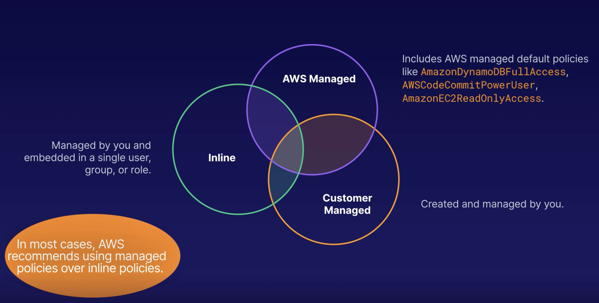

# Inline Policy vs AWS Managed Policy vs Customer Managed Policy

## AWS Managed Policies
- IAM policy created and administered by AWS
    ### AWS managed default policies
    - AmazonDynamoDBFullAccess 
    - AWSCodeCommitPowerUser
    - AmazonEC2ReadOnlyAccess
- Assign appropriate permissions to your users without having to write the policy yourself.
- Attach to multiple users, groups, or roles in the same AWS account or accross different accounts
- You cannot change the permissions defined in the AWS managed policy.

## Customer Managed Policies
- Created by you: 
    - A standalone policy that you create and administer inside your own AWS account. You can attach this policy to multiple users, groups and roles within your `own` account
- Copy an Existing Policy
    - You can copy an existing AWS managed policy and customize it to fit the requirements of your organization.
- Your needs
    - Recommended for use-case where the existing AWS managed policies don't meet the needs of your environment.

## Inline Policies
- 1:1 Relationship between the entity and policy
- Embedded: When you delete user/group/role with inline policy embedded, the policy will also be deleted.
- Single User, Group or Role

*AWS recommends using managed policies over inline policies.*

