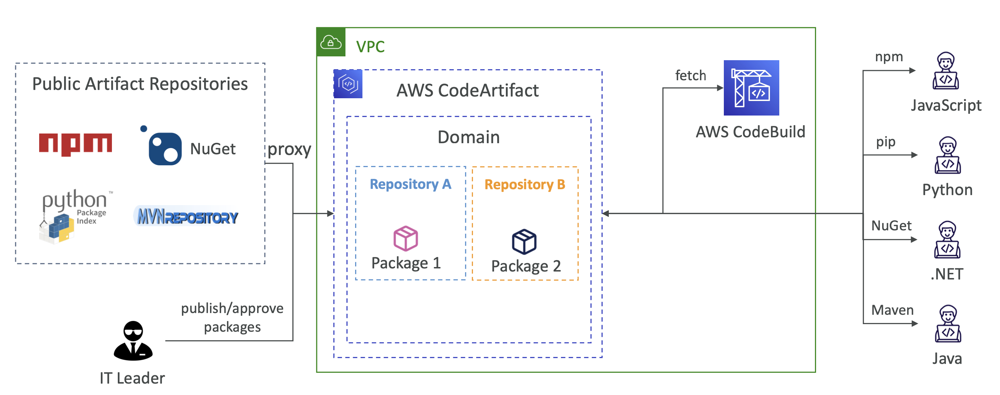
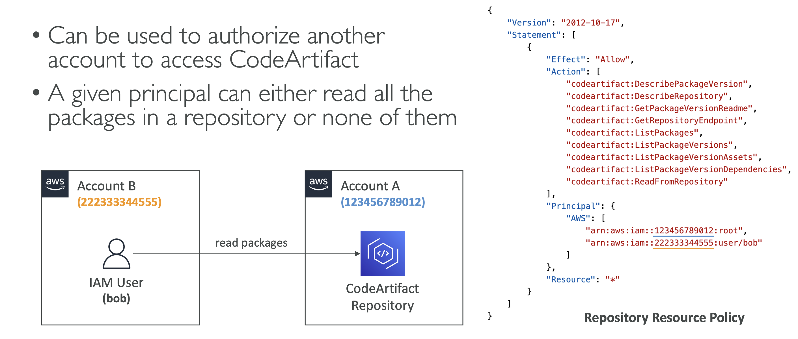
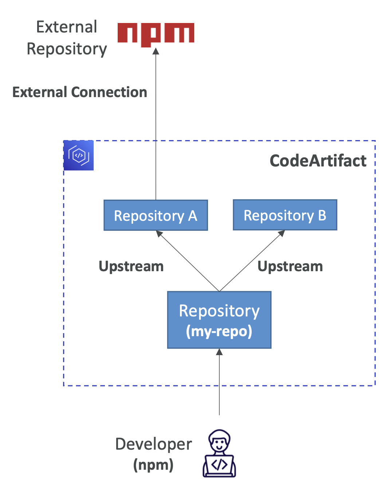
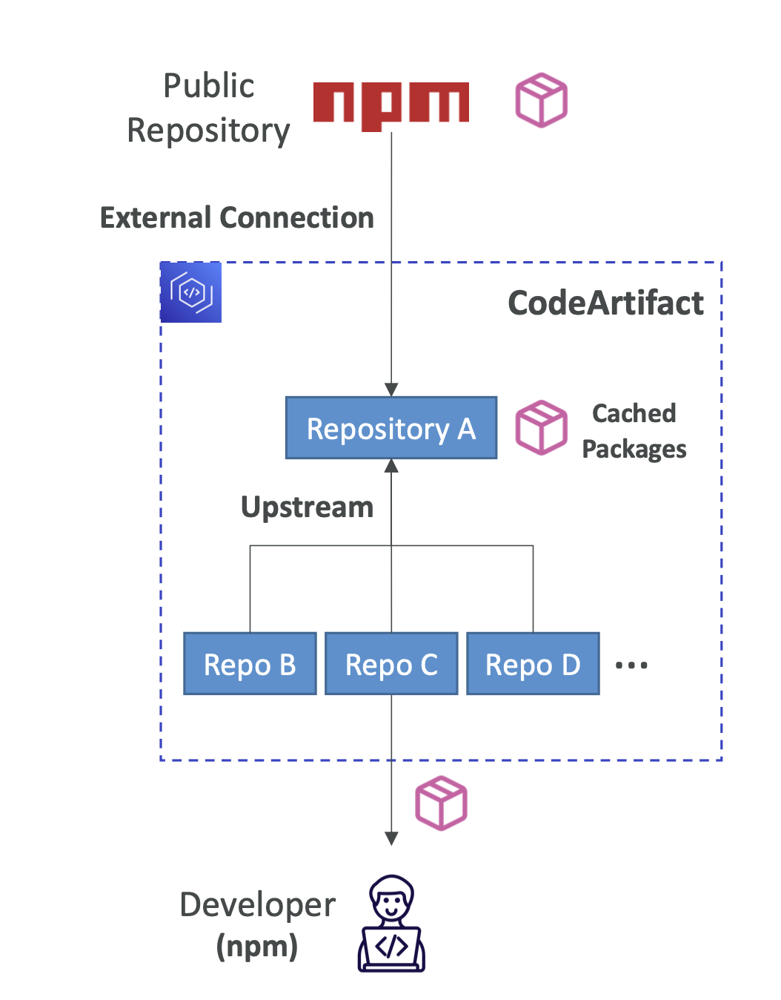
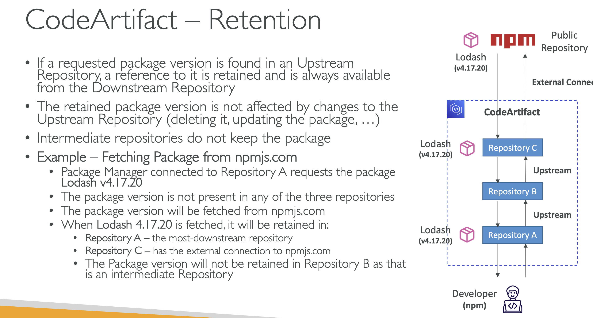

# AWS CodeArtifact
- Software packages depend on each other to be built (also called code dependencies), and new ones are created
- Storing and retrieving these dependencies is called artifact management
- Traditionally you need to setup your own artifact management system
- CodeArtifact is a secure, scalable, and cost-effective artifact management for software development
- Works with common dependency management tools such as Maven, Gradle, npm, yarn, twine, pip, and NuGet
- Developers and CodeBuild can then retrieve dependencies straight from CodeArtifact

# CodeArtifact – Resource Policy

# CodeArtifact – Upstream Repositories

* A CodeArtifact repository can have other CodeArtifact repositories as Upstream Repositories
* Allows a package manager client to access the packages that are contained in more than one repository using a single repository endpoint
* Up to 10 Upstream Repositories
* Only one external connection

# CodeArtifact – External Connection

* An External Connection is a connection between a CodeArtifact Repository and an external/public repository (e.g., Maven, npm, PyPI, NuGet...)
* Allows you to fetch packages that are not already present in your CodeArtifact Repository
* A repository has a maximum of 1 external connection
* Create many repositories for many external connections
* Example – Connect to npmjs.com
    * Configure one CodeArtifact Repository in your domain with an external connection to npmjs.com
    * Configure all the other repositories with an upstream to it
    * Packages fetched from npmjs.com are cached in the Upstream Repository, rather than fetching and storing them in each Repository

# CodeArtifact – Retention

# CodeArtifact – Domains

* Deduplicated Storage – asset only needs to be stored once in a domain, even if it's available in many repositories (only pay once for storage)
* Fast Copying – only metadata record are updated when you pull packages from an Upstream CodeArtifact Repository into a Downstream
* Easy Sharing Across Repositories and Teams – all the assets and metadata in a domain are encrypted with a single AWS KMS Key
* Apply Policy Across Multiple Repositories – domain administrator can apply policy across the domain such as:
    * Restricting which accounts have access to repositories in the domain
    * Who can configure connections to public repositories to use as sources of packages