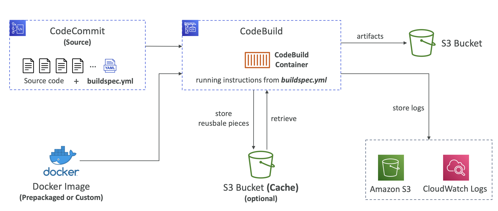
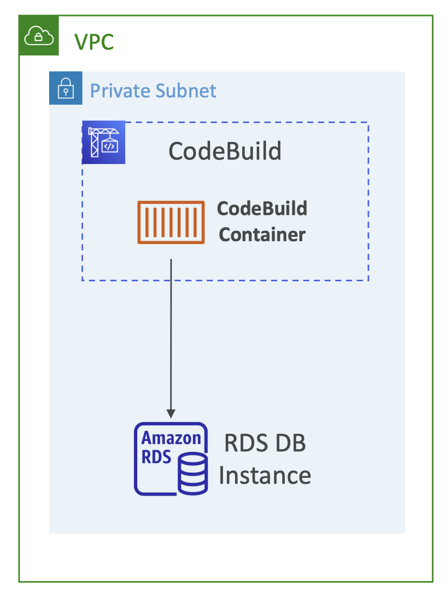

# AWS CodeBuild

* A fully managed continuous integration (CI) service
* Continuous scaling (no servers to manage or provision – no build queue)
* Compile source code, run tests, produce software packages, ...
* Alternative to other build tools (e.g., Jenkins)
* Charged per minute for compute resources (time it takes to complete the builds)
* Leverages Docker under the hood for reproducible builds
    * Use prepackaged Docker images or create your own custom Docker image
* Security:
    * Integration with KMS for encryption of build artifacts
    * IAM for CodeBuild permissions, and VPC for network security
    * AWS CloudTrail for API calls logging

# AWS CodeBuild
* Source – CodeCommit, S3, Bitbucket, GitHub
* Build instructions: Code file `buildspec.yml` or insert manually in Console
* Output logs can be stored in Amazon S3 & CloudWatch Logs
* Use CloudWatch Metrics to monitor build statistics
* Use EventBridge to detect failed builds and trigger notifications
* Use CloudWatch Alarms to notify if you need “thresholds” for failures
* Build Projects can be defined within CodePipeline or CodeBuild

# CodeBuild – Supported Environments
* Java
* Ruby
* Python
* Go
* Node.js
* Android
* .NET Core
* PHP
* Docker – extend any environment you like

# CodeBuild - How it Works

# CodeBuild – buildspec.yml

* `buildspec.yml` file must be at the root of your code
* `env` – define environment variables
    * `variables` – plaintext variables
    * `parameter-store` – variables stored in SSM Parameter Store
    * `secrets-manager` – variables stored in AWS Secrets Manager
* `phases` – specify commands to run:
    * `install` – install dependencies you may need for your build
    * `pre_build` – final commands to execute before build
    * `build` – actual build commands
    * `post_build` – finishing touches (e.g., zip output)
* `artifacts` – what to upload to S3 (encrypted with KMS)
* `cache` – files to cache (usually dependencies) to S3 for future build speedup

# CodeBuild – Inside VPC

* By default, your CodeBuild containers are launched outside your VPC
* It cannot access resources in a VPC
* You can specify a VPC configuration: 
    * VPC ID
    * Subnet IDs
    * Security Group IDs
* Then your build can access resources in your VPC (e.g., RDS, ElastiCache, EC2, ALB, ...)
* Use cases: integration tests, data query, internal load balancers, ...
