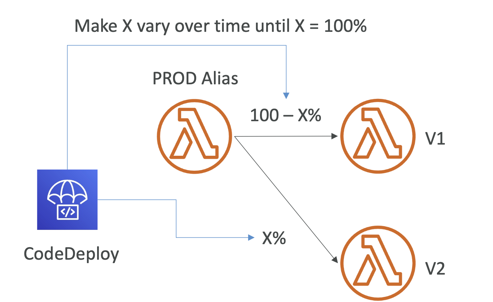
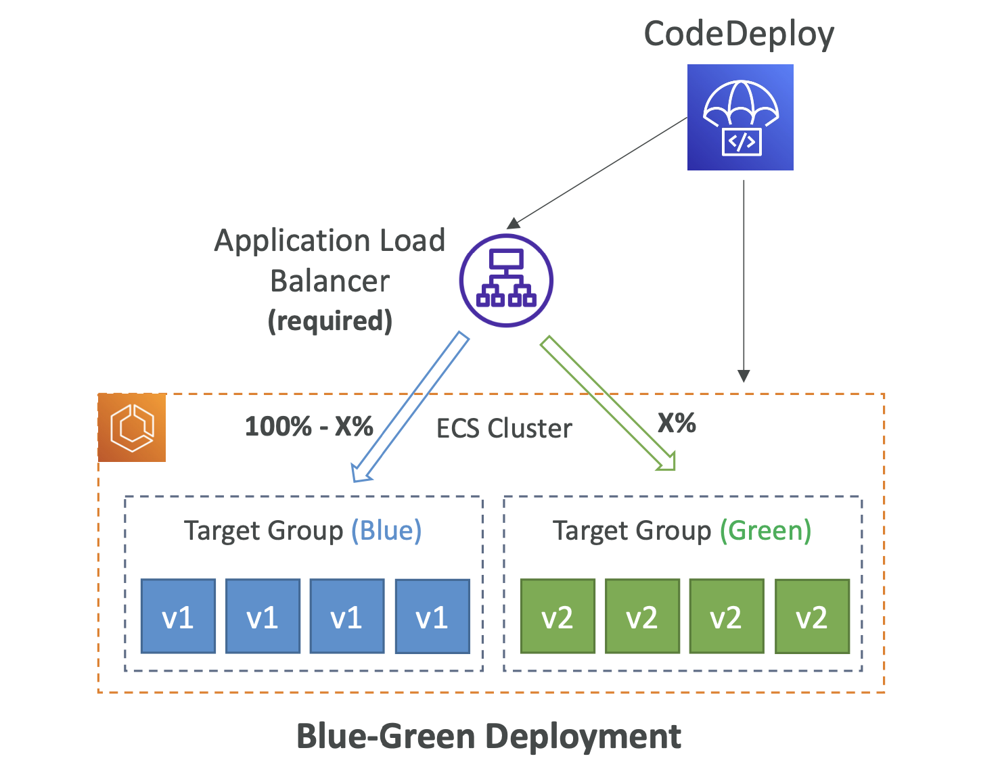
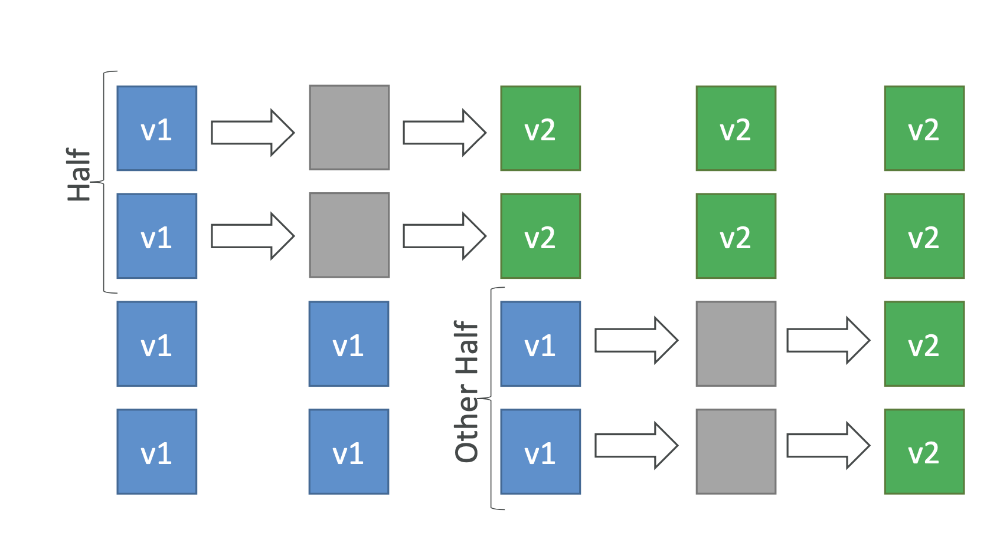
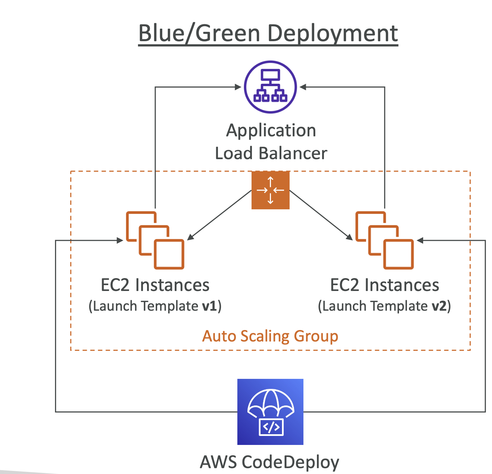

# AWS CodeDeploy

* Deployment service that automates application deployment
* Deploy new applications versions to EC2 Instances, On-premises servers, Lambda functions, ECS Services
* Automated Rollback capability in case of failed deployments, or trigger CloudWatch Alarm
* Gradual deployment control
* A file named `appspec.yml` defines how the deployment happens

# CodeDeploy – EC2/On-premises Platform

* Can deploy to EC2 Instances & on-premises servers
* Perform in-place deployments or blue/green deployments
* Must run the CodeDeploy Agent on the target instances
* Define deployment speed
    * AllAtOnce: most downtime
    * HalfAtATime: reduced capacity by 50%
    * OneAtATime: slowest, lowest availability impact
    * Custom: define your %

# CodeDeploy Agent

* The CodeDeploy Agent must be running on the EC2 instances as a pre-requisite
* It can be installed and updated automatically if you’re using Systems Manager
* The EC2 Instances must have sufficient permissions to access Amazon S3 to get deployment bundles

# CodeDeploy – Lambda Platform

* CodeDeploy can help you automate traffic shift for Lambda aliases
* Feature is integrated within the SAM framework
* Linear: grow traffic every N minutes until 100%
    * LambdaLinear10PercentEvery3Minutes
    * LambdaLinear10PercentEvery10Minutes
* Canary: try X percent then 100%
    * LambdaCanary10Percent5Minutes
    * LambdaCanary10Percent30Minutes
* AllAtOnce: immediate

# CodeDeploy – ECS Platform

* CodeDeploy can help you automate the deployment of a new ECS Task Definition
* Only Blue/Green Deployments
* Linear: grow traffic every N minutes until 100%
    * ECSLinear10PercentEvery3Minutes
    * ECSLinear10PercentEvery10Minutes
* Canary: try X percent then 100%
    * ECSCanary10Percent5Minutes
    * ECSCanary10Percent30Minutes
* AllAtOnce: immediate

# CodeDeploy – Deployment to EC2

* Define how to deploy the application using `appspec.yml` + Deployment Strategy
* Will do In-place update to your fleet of EC2 instances
* Can use hooks to verify the deployment after each deployment phase

# CodeDeploy – Deploy to an ASG

* In-place Deployment
    * Updates existing EC2 instances
    * Newly created EC2 instances by an ASG will also get automated deployments
* Blue/Green Deployment
    * A new Auto-Scaling Group is created (settings are copied)
    * Choose how long to keep the old EC2 instances (old ASG)
    * Must be using an ELB

# CodeDeploy – Redeploy & Rollbacks

* Rollback = redeploy a previously deployed revision of your application
* Deployments can be rolled back:
    * Automatically – rollback when a deployment fails or rollback when a CloudWatch Alarm thresholds are met
    * Manually
* Disable Rollbacks — do not perform rollbacks for this deployment
* If a roll back happens, CodeDeploy redeploys the last known good revision as a new deployment (not a restored version)

# CodeDeploy – Troubleshooting

* Deployment Error:“InvalidSignatureException – Signature expired: [time] is now earlier than [time]”
    * For CodeDeploy to perform its operations, it requires accurate time references
    * If the date and time on your EC2 instance are not set correctly, they might not match the signature date of your deployment request, which CodeDeploy rejects
* Check log files to understand deployment issues
    * For Amazon Linux, Ubuntu, and RHEL log files stored at `/opt/codedeploy-agent/deployment-root/deployment-logs/codedeploy-agent-deployments.log`