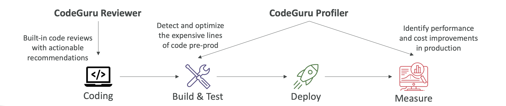

# Amazon CodeGuru

* An ML-powered service for automated code reviews and application performance recommendations
* Provides two functionalities:
    * CodeGuru Reviewer: automated code reviews for static code analysis (development)
    * CodeGuru Profiler: visibility/recommendations about application performance during runtime (production)

# Amazon CodeGuru Reviewer

* Identify critical issues, security vulnerabilities, and hard-to-find bugs
    * Example: common coding best practices, resource leaks, security detection, input validation
* Uses Machine Learning and automated reasoning
    * Hard-learned lessons across millions of code reviews on 1000s of open-source and Amazon repositories
* Supports Java and Python
* Integrates with GitHub, Bitbucket, and AWS CodeCommit

# Amazon CodeGuru Profiler

* Helps understand the runtime behavior of your application
    * Example: identify if your application is consuming excessive CPU capacity on a logging routine
* Features:
    * Identify and remove code inefficiencies
    * Improve application performance (e.g., reduce CPU utilization)
    * Decrease compute costs
    * Provides heap summary (identify which objects using up memory)
    * Anomaly Detection
* Support applications running on AWS or on-premise
* Minimal overhead on application

# AWS Cloud9

* Cloud-based Integrated Development Environment (IDE)
* Code editor, debugger, terminal in a browser
* Work on your projects from anywhere with an internet connection
* Prepackaged with essential tools for popular programming languages (JavaScript, Python, PHP,...)
* Share your development environment with your team (pair programming)
* Fully integrated with AWS SAM & Lambda to easily build serverless applications

<https://aws.amazon.com/cloud9/>
