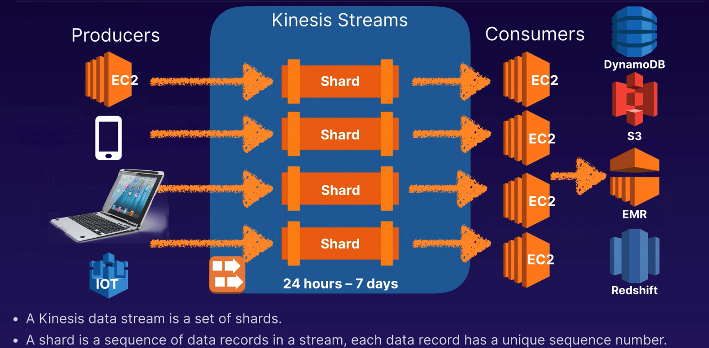
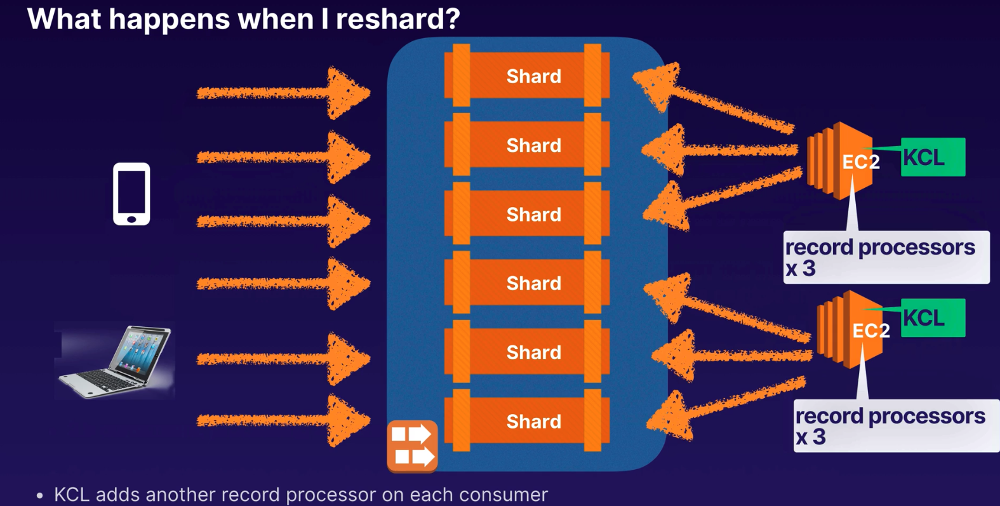

# Other AWS Service

## SQS
- SQS is a distributed message queueing system.
- Allow us to decouple the components of an application so that they are independent.
- Pull-based, not push-based.
  ## SQS Features
  - Decouple the components of an application so they run independently, easing management between components.
  - Any component can store messages in the queue. Messages can contain up to 256 KB of text in any format
  - Any component can later retrieve messages using SQS API.

  ## SQS Key Facts
  - Pull-Based
  - Messages are `256 KB` in size
  - Text Data: XML, JSON, unformatted text.
  - Guarantee: Messages will be processed at least once.
  - Messages can be kept in queue from one minute to 14 days.

  ### SQS Queue Types
    #### Standard Queues (default)
    - Nearly unlimited number of transactions per second.
    - Guarantee message is delivered at least once.
    - Provides best-effort ordering which ensures messages are generally delivered in the same order as they are sent.
    - Might contain duplicate.
    #### FIFO (First-in-first-out) Queues
    - Order in which messages are sent and received is strictly preserved.
    - A message is delivered once and remains available until a consumer processes and deletes it. 
    - Duplicates are not introduced.
    - 300 TPS limit

    | Standard                          | FIFO                                                                  |
    |:----------------------------------|:----------------------------------------------------------------------|
    | Best-effort ordering              | First-in-first-out message order is strictly presereved               |
    | Message delivered at least once   | Messages are delivered once.                                          |
    | Occational duplicates             | No duplicates                                                         |
    | Default queue type                | Good for banking transactions which need to happen in a strict order. |

  ### SQS Settings
    #### Visibility Timeout
    - Default 30 seconds.
    - Increase if the task takes more than 30 seconds to complete.
    - Max is 12 hours.

    | Short Polling                          | Long Polling                                                                  |
    |:----------------------------------|:----------------------------------------------------------------------|
    | Returns a response immediately even if the message queue being polled is empty| Periodically polls the queue. |
    | Can result in alot of empty responses if nothing is in the queue.| Doesn't return a response until a message arrives in the message queue or the long poll times out|
    | You will still pay for theses responses| Can save money!|
    | | Long polling is generally preferable to short polling.|

  ### SQS Delay Queues & Large Messages
    #### SQS Delay Queues
    - Postpone delivery of new messages to a queue for a number of seconds
    - Messages sent to the Delay Queue remain invisible to consumers for the duration of the delay period.
    - Default delay is 0 seconds, maximum is 900 seconds.
    - For standard queues, changing the setting doesn't affect the delay of messages already in the queue, only new messages.
    - For FIFO queues, this affects the delay of messages already in the queue.
    #### SQS Delay Queue use-case
    - add delay of a few seconds to allow updates to your sales and stock control databases before sending notification to a customer confirming an online transaction.

    #### Managing Large SQS Messages
    - Store large messages - 256 KB - 2 GB in S3
    - AWS SDK for Java, provides API for S3 bucket and object operations.
    - Amazon SQS Extended Client Library for Java to manage them in S3
    - Cannot use: AWS CLI, AWS Manangement Console / SQS Console, SQS API

## SNS Simple Notification Service
- A webservice that makes it wasy to set up, operate and send notification from the cloud.
  ### Push Notifications
  - To devices (e.g. Apple, Google, Windows, Android)
  ### SMS and email
  - SMS text message or email to Amazon SQS or any HTTP endpoint
  ### Lambda
  - Trigger Lambda functions to process the information in the message, publish to another SNS topic, or send the message to another AWS Service.
  ### How does it work?
  - Pub-Sub model, Publish and subscribe.
  - Applications PUBLISH or PUSH messages to a TOPIC.
  - Subscribers RECEIVE messages from a TOPIC.
  ### What is SNS Topic
  - It is an access point, allowing recipients to subscribe to, and receive identical copies of the same notification.
  - SNS delivers appropriately-formatted copies of the message to each subscriber (e.g. IOS, Android, SMS)

  ### Durability
  - Prevents message from being lost.
  - All message published to Amazon SNS are stored reduntantly across multiple Availability Zones.
  
  ### SNS Benefits
  - Instaneous push-based delivery
  - Simple APIs and easy integration with applications.
  - Flexible message delivery over multiple transport protocols.
  - Inexpensive, pay-as-you-go model, no up-front costs.
  - Easy to configure, AWS management console, point-and-click interface.
  - High availability and durability.

  ### SNS vs SQS
    | SNS                       | SQS                                  |
    |:--------------------------|:-------------------------------------|
    | Messaging service.        | Messaging service.                   |
    | Push-based.               | Pull-based.                          |
    | Think push notification.  | Think polling the queue for messages |

  ### SNS Exam Tips
    #### Notifications
    - Scalable and highly available notification service which allows us to send push notifications from the cloud.
    #### Message Formats
    - SMS text message, email, SQS queues, any HTTP endpoint
    #### Pub-Sub
    - Pub-sub model whereby users subscribe to topics. Push mechanism rather than a pull (or poll) mechanism.

    

  ### SES vs SNS
    #### Simple Email Service
    - Scable and Highly Available Email
    - Send and Receive Email delivered to S3 bucket.
    - Trigger Lambda and SNS
      ##### SES use-case
      - Automated Emails
      - Online Purchases
      - Marketing Emails

    | SES                       | SNS                                  |
    |:--------------------------|:-------------------------------------|
    | Email messaging service.  | Pub/sub messaging service. SMS, HTTP, SQS, email                   |
    | Can trigger a Lambda function or SNS notification.               | Can trigger a Lambda function.                          |
    | Can be used for incoming and outgoing email.  | Can fanout messages to a large number of recipients |
    | An email address is all that is required to start sending messages. | Consumers must subscribe to a topic to receive the notifications.|

    ### SES Exam Tips
    

## Kinesis 
Greek Word for movement or motion.
Amazon Kinesis deals with data in motion, or streaming data.

  ### Kinesis Stream
  - Data Streams
  - Video Streams
  ### Kinesis Data Firehose
  - Capture, transform and load data streams into AWS data stores to enable near real-time analytics with BI tools
  ### Kinesis Data Analytics
  - Analyse, query, and transform streamed data in real time using standard SQL. 

  ### Stream vs Firehose vs Analytics
  | Streams                         | Firehose         | Analytics          |
  |:--------------------------------|:--------------------|:----------------|
  | `Capture` and `store` streaming `video` and `data`. Consumer applications process and analyse the data in real time | `Capture`, `transform` and `load` data continously into AWS `data stores`. Existing BI applications and tools can be used for near real-time analysis of the stored data. | `Real-time analytics` using standard `SQL` on data `received by Kinesis Data Streams and Kinesis Data Firehose`. Stores and processed data in AWS data stores (e.g. S3, Redshift or OpenSearch). |
  
  ### Kinesis Shards and Consumers
  
  #### Shards

  #### Consumers

  

  #### Summary
  - The Kinesis Client Library running on your consumers creates a record processor for each shard that is being consumed by your instance.
  - if you increase the number of shards, the KCL will add more record processors on your consumers
  - CPU Utilisation is what should drive the quantity of consumer instances you have, **NOT** the number of shards in your Kinesis stream.
  - Use an Auto Scaling group, and base scaling decisions on CPU load on your consumers.

## Elastic Beanstalk
- Infrastructure
  - Provisioning infrastructure , load balancing, Auto Scaling, and application health monitoring.
- Application platform
  - Installtion and management of the application stack, including patching and updates to your operating system and application platform.
- You are in Control
  - Complete Administrative control of the AWS resouces.

  ### Elastic Beanstalk Summary
  - Deploy and scale your web applications, including the web application server platform.
  - Programming Languages: Java, PHP, Python, Ruby, Go, .NET, Node.js
  - Managed Platforms: Apache Tomcat, Docker.
  - Provision AWS Resorces: EC2, RDS, S3, Elastic Load Balancers, Auto Scaling Group, etc
  - System Administration: OS and application server updates. Monitoring, metrics, and health checks.
  - Adminstrative Control: Fully manage the EC2 instances for you, or can take full administrative control.

  ### Elastic Beanstalk deployment types
    #### All at Once
    - Involves a service interruption.
    - Rolling back requires a further All at Once update.
    #### Rolling
    - Reduced capacity during deployment.
    - Rolling back requires a further Rolling update.
    #### Rolling with Additional Batch
    - Maintains full capacity.
    - Rolling back requires a further Rolling update.
    #### Immutable
    - Maintains full capacity.
    - To roll back, delete the new instances. 
    - Preferred option for mission critical production systems.
    #### Traffic Splitting
    - Performs an Immutable deployment and then splits the traffic between the old and new deployment, enabling Canary Testing.

  ### Advanced Elastic Beanstalk 
  Customize Elastic Beanstalk environment:
    #### .ebextenstions folder
    - located in top-level directory of application source code bundle.
    - Files mut have .config extension (e.g. healthcheckurl.config)
    - Amazon Linux 1

    #### Buildfile
    - Create a Buildfile in root directory of application source for commands that exit upon completion (e.g. shell scripts)
    - Amazon Linux 2

    #### Procfile
    - Create Procfile for long-running processes (e.g, custom commands to start your application)
    - Amazon Linux 2

    #### Platform Hooks
    - Custom scripts or executables that runs at various stages when EC2 instances are provisioned.
    - Amazon Linux 2
      - platform/hooks/prebuild 
      - platform/hooks/predeploy 
      - platform/hooks/postdeploy 
     

## RDS & Elastic Beanstalk
  ### Option 1: Launch RDS inside of Elastic Beanstalk
  - Quick and easy to add db and get started
  - When you terminate Elastic Beanstalk environment, the database will also be terminated.
  - Suitable for Dev and Test environments.
  ### Option 2: Launch RDS outside of Elastic Beanstalk
  - You can tear down the application stack without impacting the database.
  - Additional configuration steps required - Security Group, and connection informations as environment properties.
  - Suitable for PROD environments

## Migrating applications to Elastic Beanstalk
- Windows Web Application Migration Assistant for Elastic Beanstalk
  - Formerly named the .NET Migration Assistant.
  - Open-source, interactive PowerShell utility that migrats Windows server to Elastic Beanstalk.

## Other AWS Servics Summary