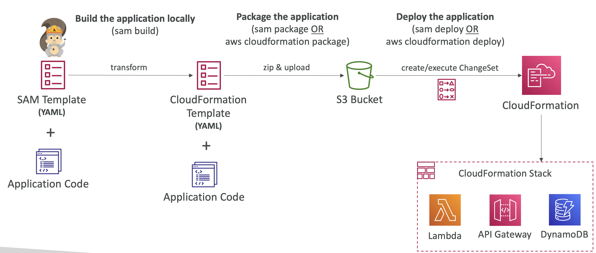

# AWS SAM
- SAM = Serverless Application Model
- Framework for developing and deploying serverless applications
- All the configuration is YAML code
- Generate complex CloudFormation from simple SAM YAML file
- Supports anything from CloudFormation: Outputs, Mappings, Parameters, Resources...
- Only two commands to deploy to AWS
- SAM can use CodeDeploy to deploy Lambda functions
- SAM can help you to run Lambda, API Gateway, DynamoDB locally

# SAM Deployment

# SAM Policy Templates
- List of templates to apply permissions to your Lambda Functions
- Full list available here: [AWS SAM Policy Templates](https://docs.aws.amazon.com/serverless-application-model/latest/developerguide/serverless-policy-templates.html#serverless-policy-template-table)

## Important examples:
- `S3ReadPolicy`: Gives read only permissions to objects in S3
- `SQSPollerPolicy`: Allows to poll an SQS queue
- `DynamoDBCrudPolicy`: CRUD = create read update delete

# SAM – Exam Summary
- SAM is built on CloudFormation
- SAM requires the Transform and Resources sections

## Commands to know:
- `sam build`: fetch dependencies and create local deployment artifacts
- `sam package`: package and upload to Amazon S3, generate CF template
- `sam deploy`: deploy to CloudFormation

- SAM Policy templates for easy IAM policy definition
- SAM is integrated with CodeDeploy to do deploy to Lambda aliases

# Serverless Application Repository (SAR)
- Managed repository for serverless applications
- The applications are packaged using SAM
- Build and publish applications that can be re-used by organizations
- Can share publicly
- Can share with specific AWS accounts
- This prevents duplicate work, and just go straight to publishing
- Application settings and behaviour can be customized using Environment variables
