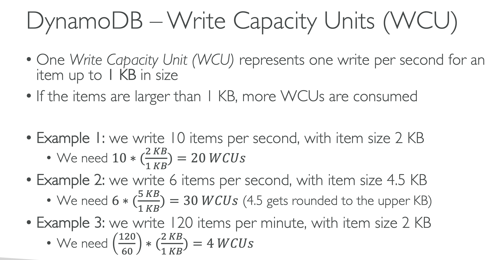
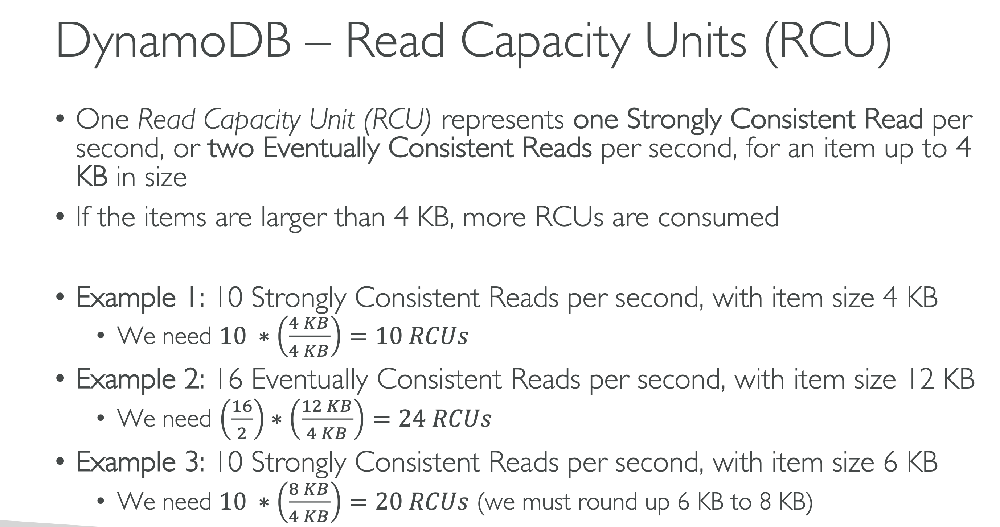

# DynamoDB Key Takeaways

## Overview
- DynamoDB is a NoSQL serverless database, different from traditional RDBMS databases like MySQL or PostgreSQL.
- It provides horizontal scalability, unlike RDBMS databases which mostly scale vertically.

## Features
- DynamoDB is fully distributed, meaning it can scale to millions of requests per second, trillions of rows, and hundreds of terabytes of storage.
- It offers fast and consistent performance with low latency on retrieval.
- It's fully integrated with IAM for security, authorization, and administration.
- It supports event-driven programming with DynamoDB Streams.
- It's low cost and has auto-scaling capability.
- It provides different storage tiers with the standard and Infrequent Access (IA) table class.

## Data Structure
- DynamoDB is made out of tables, each having a primary key that must be defined before creating the table.
- Each table can have an infinite number of rows (also called items), and each item has attributes (similar to columns in a table).
- Attributes can be nested, added over time, and can be null.
- Each item can have up to 400 kilobytes of data.

## Primary Key
- Two options for primary keys: partition key (hash strategy) and partition key + sort key (hash + range).
- The partition key must be unique for each item.
- The combination of partition key and sort key must be unique for each item.
- The choice of partition key is crucial for data distribution. It should have high cardinality (can take on the most amount of values).

## Exam Tips
- For the exam, you may be asked to choose the best partition key for some tables. Always choose the one with the highest cardinality.
- DynamoDB does not support query joins or perform aggregation computations such as SUM or AVG.

Here are some of the key parameters you should be familiar with for the AWS Developer Associate exam:

| Parameter | Description |
| --- | --- |
| `TableName` | Specifies the name of the DynamoDB table. |
| `KeyConditionExpression` | A string that specifies the conditions for the query. |
| `ExpressionAttributeValues` | A dictionary that maps the substitution variables in your `KeyConditionExpression` to their actual values. |
| `ExpressionAttributeNames` | A dictionary that maps the placeholder names in your `KeyConditionExpression` to the actual attribute names in your table. |
| `ProjectionExpression` | A string that identifies one or more attributes to retrieve from the table. |
| `FilterExpression` | A string that contains conditions that DynamoDB applies after the `KeyConditionExpression`, but before the data is returned to you. |
| `ScanIndexForward` | Specifies the order for index traversal: If `True` (default), the traversal is performed in ascending order; if `False`, the traversal is performed in descending order. |
| `Limit` | The maximum number of items to evaluate (not necessarily the number of matching items). |
| `ConsistentRead` | If `True`, a strongly consistent read is used; if `False` (default), an eventually consistent read is used. |
| `IndexName` | The name of a secondary index to scan. This index can be any local secondary index or global secondary index. |

For the AWS Developer Associate exam, you should be familiar with these parameters and understand how they are used in different scenarios. You should also understand the difference between a `Query` and a `Scan` operation, how to use secondary indexes, and how to design and interact with DynamoDB tables in a way that optimizes for performance and cost.

# DynamoDB - Basics

- DynamoDB is made of Tables
- Each table has a Primary Key (must be decided at creation time)
- Each table can have an infinite number of items (= rows)
- Each item has attributes (can be added over time – can be null)
- Maximum size of an item is 400KB
- Data types supported are:
    - Scalar Types
        - String
        - Number
        - Binary
        - Boolean
        - Null
    - Document Types
        - List
        - Map
    - Set Types
        - String Set
        - Number Set
        - Binary Set
For the AWS Certified Developer Associate exam, it's important to have a broad understanding of DynamoDB, as well as how it interacts with other AWS services. Here are some key areas you should focus on:

# AWS Certified Developer Associate: DynamoDB Study Points

## Basics of DynamoDB
- Understand what DynamoDB is and its key features.
- Know about tables, items, attributes, primary keys, and indexes.
- Understand different types of primary keys (partition key and composite key).
- Be aware of the maximum item size (400KB).

## Capacity Units and Performance
- Understand Read Capacity Units (RCUs) and Write Capacity Units (WCUs).
- Understand provisioned and on-demand capacity modes.
- Know about auto-scaling.

## DynamoDB Indexes
- Understand the purpose and use cases of Global Secondary Indexes (GSIs) and Local Secondary Indexes (LSIs).
- Know the differences between GSIs and LSIs.

## Consistency Models
- Understand the difference between strongly consistent and eventually consistent reads.

## DynamoDB Streams and Lambda Triggers
- Understand DynamoDB Streams and common use cases.
- Know how to use AWS Lambda with DynamoDB to create triggers.

## DynamoDB and DAX
- Know what Amazon DynamoDB Accelerator (DAX) is and when to use it.
- Understand the benefits of DAX.

## Security
- Understand how to control access to DynamoDB using IAM policies.
- Be aware of encryption at rest and in transit.

## Integration with other AWS Services
- Understand how DynamoDB can integrate with other services like AWS Lambda, API Gateway, and S3.

## Best Practices
- Understand best practices for designing tables, choosing primary keys, and avoiding hot partitions.
- Be aware of best practices for cost optimization.

# DynamoDB Read/Write Capacity Units (RCUs and WCUs)

## Read Capacity Units (RCUs)
- One RCU represents one strongly consistent read per second, or two eventually consistent reads per second, for an item up to 4 KB in size.
- If your read operation retrieves items larger than 4 KB, you will need additional RCUs. For example, a strongly consistent read of an 8 KB item would require 2 RCUs.

## Write Capacity Units (WCUs)
- One WCU represents one write per second for an item up to 1 KB in size.
- If your write operation involves items larger than 1 KB, you will need additional WCUs. For example, a write of a 3 KB item would require 3 WCUs.

## Provisioned Throughput
- When you create a table or a global secondary index, you set the provisioned read and write capacity to the estimated number of RCUs and WCUs that you need.
- However, if your application's traffic pattern is variable, you should consider enabling auto scaling.

## Auto Scaling
- With auto scaling, DynamoDB automatically adjusts the number of RCUs and WCUs up or down in response to actual workloads.
- This feature can help optimize costs by ensuring that you only pay for the throughput you need.

## Burst Capacity
- DynamoDB provides a limited burst capacity pool for tables to handle sudden increases in traffic.
- New tables and indexes have 300 WCUs and 100 RCUs of burst capacity, while existing tables and indexes have their burst capacity gradually refilled during periods of inactivity.

